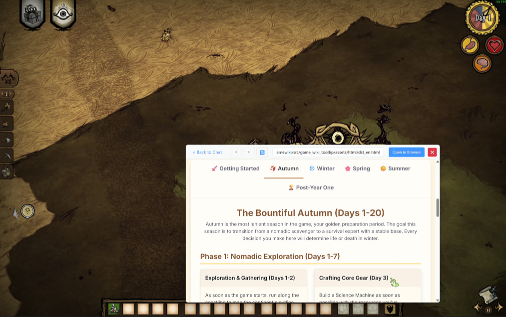

# GameWikiTooltip - AI游戏智能助手 🎮🤖

> **你的专属游戏AI伙伴** - 游戏内Wiki悬浮窗 + AI知识库问答，游戏中即时获取攻略


[](https://github.com/rimulu030/gamewiki/releases)

👉 **[English](README.md)** | **[快速开始](#-快速安装)** | **[下载最新版本](https://github.com/rimulu030/gamewiki/releases/download/v1.0.0/GameWikiAssistant_Portable_onedir.zip)**

## ✨ 为什么选择GameWikiTooltip？

再也不用切出游戏查攻略！一键呼出AI助手，在游戏内直接获取Wiki信息、装备推荐、Boss攻略。

### 🎯 核心功能

- **🔥 一键呼出，即问即答** - 按下`Ctrl+Q`，无需切屏即可查询攻略
- **🤖 AI游戏专家** - 基于Google Gemini + 本地知识库的智能问答

为使用AI问答功能，你需要一个谷歌账号并从Google AI Studio获取GEMINI API

_“Gemini API“免费层级”通过 API 服务提供，具有较低的[速率限制](https://ai.google.dev/gemini-api/docs/rate-limits#free-tier)，仅用于测试目的。在所有支持的国家/地区，Google AI Studio 的使用**完全免费**。”_ -根据[Gemini API文档](https://ai.google.dev/gemini-api/docs/pricing)

## 🚀 快速安装

### 方式一：下载便携版（推荐）
1. **[⬇️ 下载最新版本](https://github.com/rimulu030/gamewiki/releases/download/v1.0.0/GameWikiAssistant_Portable_onedir.zip)**
2. 解压ZIP文件
3. 运行`GameWikiAssistant.exe`
4. 设置热键，开始游戏！

💡 **无游戏试用AI对话功能**：如果你想试用AI对话功能但电脑上没有支持的游戏，可以创建一个文件夹，并重命名为存在知识库的游戏名称（如"饥荒联机版"或"地狱潜兵2"），然后将焦点放在对应名称的文件夹上并触发热键即可访问AI助手。示例"how can I catch a rabbit?"

### 方式二：源码运行
```bash
# 克隆并安装
git clone https://github.com/rimulu030/gamewiki.git
cd gamewiki
pip install -r requirements.txt

# 配置AI功能的API密钥（可选）
set GEMINI_API_KEY=your_key_here  # Windows
export GEMINI_API_KEY=your_key_here  # Linux/Mac

# 运行
python -m src.game_wiki_tooltip
```

## 🎮 支持的游戏

### 🤖 AI增强游戏（完整知识库）
| 游戏 | 功能特性 | 知识库状态 |
|------|----------|------------|
| **地狱潜兵2** | 武器数据、战略配置、敌人弱点 | ✅ 完整 |
| **艾尔登法环** | 物品装备、Boss攻略、Build推荐 | ✅ 完整 |
| **饥荒联机版** | 合成配方、角色指南、生存技巧 | ✅ 完整 |
| **文明6** | 文明特性、单位数据、胜利策略 | ✅ 完整 |

### 📖 Wiki支持游戏
支持100+款游戏的Wiki快速访问，包括：瓦洛兰特、CS2、怪物猎人、星露谷物语等！

## 📸 功能演示
- 作为AI助手


**[观看使用视频](https://your-video-or-doc-link)**

- 快速查询wiki结果



- 作为置顶浏览器


  
## 🔧 配置说明

### 首次启动设置
1. **热键设置**：选择你喜欢的激活键（默认：`Ctrl+Q`）
2. **API密钥**（可选）：添加Gemini API密钥以启用AI功能
3. **游戏检测**：自动检测 - 直接启动游戏即可！

### 高级设置
- 自定义热键组合
- 语言偏好设置（中/英）
- Wiki源配置
- 语音识别设置

## 📚 文档

- **[快速上手指南](docs/QUICKSTART.md)** - 5分钟快速开始
- **[常见问题](docs/FAQ.md)** - 常见问题和解决方案
- **[构建指南](docs/BUILD.md)** - 构建自己的可执行文件
- **[技术架构](docs/ARCHITECTURE.md)** - 技术深度解析
- **[AI模块文档](src/game_wiki_tooltip/ai/README.zh-CN.md)** - AI系统详情

## 🐛 故障排除

| 问题 | 快速解决 |
|------|----------|
| **热键不响应** | 以管理员身份运行 / 更换热键组合 |
| **游戏无法识别** | 查看支持的游戏列表|
| **AI不响应** | 在设置中验证API密钥 |
| **悬浮窗不显示** | 安装WebView2运行时（安装包内已包含） |

更多解决方案，请查看[常见问题](docs/FAQ.md)或[提交问题](https://github.com/rimulu030/gamewiki/issues)。

## 🤝 贡献

欢迎各种形式的贡献！无论是：
- 🎮 添加新游戏支持
- 🐛 修复Bug
- 📚 改进文档
- 🌐 翻译本地化

详见[贡献指南](docs/CONTRIBUTING.md)。

## 📄 许可证

根据pyqt6库的使用要求，我们使用了GPL3.0许可证 - 详见[LICENSE](LICENSE)文件

## 🙏 致谢

- **Google Gemini AI** - 提供智能响应能力
- **FAISS** - 超快向量搜索引擎
- **游戏社区** - 提供Wiki内容和知识
- **贡献者们** - 让这个工具越来越好

---

<div align="center">

**⭐ 如果这个工具帮助了你的游戏体验，请给我们Star！**

[报告问题](https://github.com/rimulu030/gamewiki/issues) · [功能请求](https://github.com/rimulu030/gamewiki/discussions) · [Discord社区](https://discord.gg/gamewiki)

</div>