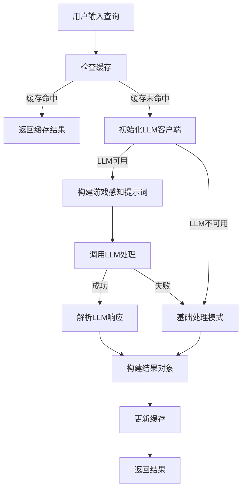

# 游戏感知统一查询处理器

## 概述

游戏感知统一查询处理器是一个通过单次LLM调用完成多项任务的智能查询处理系统，专门为游戏Wiki和攻略搜索优化。

## 主要功能

### 🔄 三步骤统一处理
通过一次LLM调用完成：
1. **中文翻译成英文**（如果需要）
2. **意图判断**（wiki信息查询 vs 攻略指南查询）
3. **结合游戏上下文重写查询**（针对Google搜索或RAG搜索优化）

### 🎮 游戏感知特性
- **自动游戏识别**：根据当前活跃窗口识别游戏
- **游戏特定术语**：使用游戏内标准术语进行查询优化
- **Wiki类型适配**：支持不同类型的Wiki网站（灰机Wiki、Kiranico等）
- **搜索策略优化**：根据查询类型选择最佳搜索策略

### 🚀 性能优化
- **智能缓存**：基于查询+游戏上下文的缓存机制
- **降级处理**：LLM不可用时自动使用基础处理模式
- **重试机制**：带指数退避的失败重试
- **统计监控**：详细的处理统计和性能监控

## 使用方法

### 基础使用

```python
from src.game_wiki_tooltip.ai.game_aware_query_processor import process_game_aware_query

# 简单查询（无游戏上下文）
result = process_game_aware_query("法师职业介绍")

# 带游戏上下文的查询
result = process_game_aware_query("法师职业介绍", "Don't Starve Together")

print(f"原始查询: {result.original_query}")
print(f"检测语言: {result.detected_language}")
print(f"翻译查询: {result.translated_query}")
print(f"重写查询: {result.rewritten_query}")
print(f"意图类型: {result.intent}")
print(f"置信度: {result.confidence}")
```

### 高级使用

```python
from src.game_wiki_tooltip.ai.game_aware_query_processor import get_game_aware_processor
from src.game_wiki_tooltip.config import LLMConfig

# 自定义LLM配置
llm_config = LLMConfig(
    model="gemini-2.5-flash-lite-preview-06-17",
    temperature=0.1,
    max_tokens=500
)

# 获取处理器实例
processor = get_game_aware_processor(llm_config)

# 处理查询
result = processor.process_query("推荐下一个解锁什么", "Helldivers 2")

# 查看详细结果
print(f"搜索优化: {result.search_optimization}")
print(f"推荐关键词: {result.suggested_keywords}")
print(f"备选查询: {result.alternative_queries}")
print(f"游戏上下文: {result.game_context}")
```

## 处理流程



## 意图分类

### Wiki意图
- **触发词**：什么是、info、stats、damage、属性、数据
- **处理策略**：保持原始查询不变，使用用户原始输入进行搜索
- **示例**：
  - "什么是法师职业" → 搜索时使用 "什么是法师职业"
  - "武器伤害数据" → 搜索时使用 "武器伤害数据"
  - "角色属性介绍" → 搜索时使用 "角色属性介绍"

### Guide意图
- **触发词**：怎么、如何、best、recommend、推荐、下一个
- **处理策略**：优化重写查询，添加相关关键词提高搜索效果
- **示例**：
  - "怎么打最终boss" → 重写为 "final boss strategy guide tips"
  - "推荐下一个解锁什么" → 重写为 "next unlock recommendation guide"
  - "最佳配装指南" → 重写为 "best build loadout guide"

## 查询重写示例

### Wiki意图（保持原始查询）
```
输入: "法师职业介绍"
翻译: "mage class introduction"
重写: "mage class introduction" (保持简洁，不添加额外内容)
搜索: 使用原始查询 "法师职业介绍"
```

### Guide意图（优化重写）
```
输入: "推荐下一个解锁什么"
游戏: "Don't Starve Together"
翻译: "recommend next unlock what"
重写: "Don't Starve Together next unlock recommendation progression guide"
搜索: 使用重写查询
```

### 搜索策略差异
```
Wiki查询: 保持用户原始输入 → 更准确的搜索结果
Guide查询: 添加指导关键词 → 获得更多攻略内容
```

## 配置选项

### LLM配置
```python
llm_config = LLMConfig(
    model="gemini-2.5-flash-lite-preview-06-17",  # 模型名称
    temperature=0.1,                    # 温度参数
    max_tokens=500,                     # 最大令牌数
    enable_cache=True,                  # 启用缓存
    cache_ttl=3600,                     # 缓存生存时间
    max_retries=3,                      # 最大重试次数
    retry_delay=1.0                     # 重试延迟
)
```

### 游戏知识库
系统自动从 `games.json` 加载游戏配置：
```json
{
    "Don't Starve Together": {
        "BaseUrl": "dontstarve.huijiwiki.com",
        "NeedsSearch": true
    }
}
```

## 统计和监控

```python
# 获取处理统计
stats = processor.get_stats()
print(f"总查询数: {stats['total_queries']}")
print(f"缓存命中: {stats['cache_hits']}")
print(f"成功处理: {stats['successful_processing']}")
print(f"平均处理时间: {stats['average_processing_time']:.3f}s")
print(f"处理过的游戏: {stats['games_processed']}")
```

## 错误处理

系统提供多层级的错误处理：

1. **LLM调用失败**：自动降级到基础处理模式
2. **网络异常**：使用重试机制和指数退避
3. **配置错误**：返回默认配置和警告日志
4. **解析错误**：提供合理的默认值

## 最佳实践

### 1. 缓存优化
- 启用缓存以提高响应速度
- 设置合适的缓存生存时间
- 定期清理过期缓存

### 2. 错误处理
- 监控处理统计，及时发现问题
- 设置合理的重试次数和延迟
- 为LLM不可用情况准备降级方案

### 3. 性能调优
- 根据使用场景调整LLM参数
- 使用游戏上下文提高查询质量
- 监控处理时间，优化慢查询

## 测试

运行测试脚本验证功能：

```bash
cd src/game_wiki_tooltip/ai
python test_game_aware_processor.py
```

测试包括：
- 基础处理模式测试
- LLM处理模式测试
- 游戏上下文对比测试
- 统计功能测试

## 注意事项

1. **API密钥**：使用LLM功能需要配置有效的API密钥
2. **网络连接**：LLM调用需要稳定的网络连接
3. **模型支持**：目前支持Gemini和OpenAI模型
4. **语言支持**：主要针对中文-英文翻译优化
5. **游戏支持**：依赖games.json中的游戏配置 